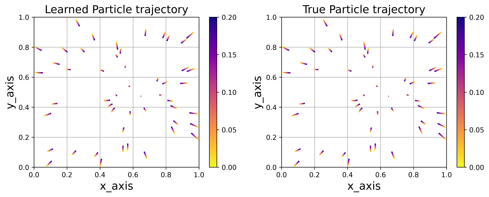
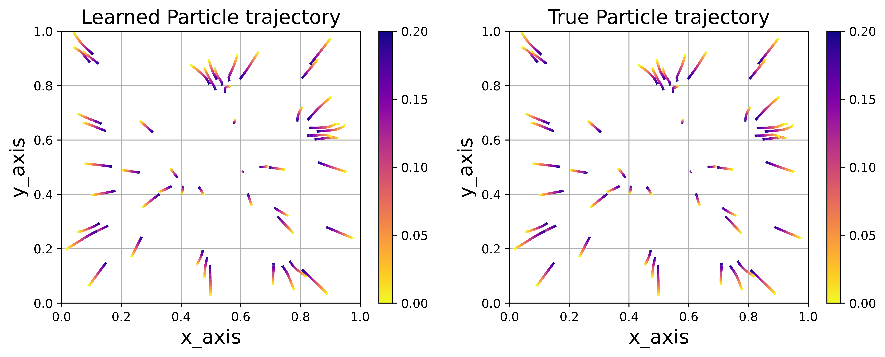
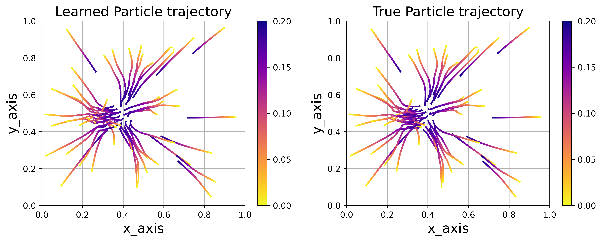

# Keller–Segel Particle Trajectories: Deterministic and Stochastic Learning
A unifed learning of the profile function of the Keller-Segel model 

## Overview 
This repository contains research code and results for studying particle-based formulations of the Keller–Segel model in multiple spatial dimensions.
We generate and analyze deterministic and stochastic particle trajectories in two, three, and four dimensions, and use these trajectories to learn interaction (profile) functions governing the particle dynamics.

Due to storage constraints, only a subset of generated trajectory data is included, while all figures corresponding to the reported results are provided.

## Model Background

The Keller–Segel model describes collective behavior driven by aggregation and diffusion mechanisms.
In this project, the model is studied through a particle system representation, allowing both deterministic and stochastic dynamics to be examined across dimensions.

## Contents of This Repository

### 1. Particle Trajectory Generation
	•	Deterministic particle trajectories
	•	2D, 3D, and 4D
	•	Stochastic particle trajectories
	•	2D and 4D

⚠️ Data availability note:
Due to file size limitations, only deterministic particle trajectories in 1D, 2D, and 3D are included in the repository.
Higher-dimensional and stochastic trajectory data were used to generate figures but are not uploaded.

### 2. Learning of Profile Functions
	•	Learned interaction/profile functions for:
	•	Deterministic particle systems
	•	Stochastic particle systems
	•	Results reported for all considered dimensions

These learned profiles characterize the effective interaction structure inferred from particle trajectories.

### 3. Learned Particle Trajectories
	•	Reconstructed particle trajectories using learned interaction functions
	•	Comparisons performed across:
	•	Dimensions (2D, 3D, 4D)
	•	Deterministic vs stochastic dynamics


## Results

All figures corresponding to:
	•	Particle trajectories
	•	Learned profile functions
	•	Learned vs true dynamics

are provided in the figures/ directory.

These figures summarize the main findings of the study without requiring access to the full trajectory datasets.

## Repository Structure 
```
.
├── data/
│   ├── KS_1D_Particle_50_cut_off_0.01_t_0.2_Chi_0.55_500.npy
│   ├── KS_2D_Particle_50_cut_off_0.01_t_0.2_Omega_2.0_500.npy
│   └── KS_3D_Particle_50_cut_off_0.01_t_0.2_Omega_2.0_500.npy
├── figures/
│   ├── KS_2D_profile_comparison_omega_2_knot_20.png
│   ├── KS_2D_trajectory_comparison_unif_omega_1_knot_20.png
│   ├── KS_2D_trajectory_comparison_unif_omega_2_knot_20.png
│   ├── KS_2D_trajectory_comparison_unif_omega_4_knot_20.png
│   ├── KS_3D_profile_comparison_omega_2_knot_25.png
│   ├── KS_3D_trajectory_comparison_unif_omega_1_knot_25.png
│   ├── KS_3D_trajectory_comparison_unif_omega_2_knot_25.png
│   ├── KS_3D_trajectory_comparison_unif_omega_4_knot_25.png
│   ├── KS_4D_SDE_kernel_comparison_chi_2_knot_20.png

│   ├── stochastic_trajectories/
│   ├── learned_profiles/
│   └── learned_trajectories/
├── KS_SDE_learn_Kernel_all_dim.py
├── KS_data_distribution.py
├── KS_SDE_learned_trajectory.py
├── Keller_Segel_2D_particle_trajectory.py
├── Keller_Segel_3D_particle_trajectory.py
├── Keller_Segel_4D_particle_trajectory.py
├── Keller_Segel_SDE_2D_particle_trajectory.py
├── Keller_Segel_SDE_4D_particle_trajectory.py
├── Learn_KS_Kernel_all_dim_data.py
├── Learn_KS_Kernel_all_dim_data_adaptive.py
├── Learn_KS_Particle_trajectories_all_dim_data.py
└── learned_trajectories.ipynb
├── README.md
```

## Notes on Reproducibility
	•	All figures in this repository are generated from the accompanying code.
	•	Full stochastic and high-dimensional trajectory datasets are omitted due to size constraints but can be regenerated using the provided scripts.

## Scope and Limitations
	•	This repository focuses on particle-based learning of the Keller–Segel model.
	•	Large-scale data storage is intentionally avoided.
	•	Numerical parameter choices and implementation details are discussed within the notebooks.

## Related Work

This project is part of an ongoing research effort on particle methods, learning interaction kernels, and variational formulations of collective dynamics. 

## Citation
If you use or build upon this work, please cite appropriately or contact the author for further details.

## Representative Results

Below we show representative examples of learned particle dynamics.
Full numerical experiments and analysis are provided in the accompanying preprint.

### Original vs Reconstructed Particle Trajectories

<p align="center">
  
</p>

<p align="center">
  
</p>

<p align="center">
  
</p>

## Preprint

A detailed description of the model, methodology, and numerical results
is available in the following preprint:

- **Title:** Learning Interaction Kernels in the Keller–Segel Particle System
- **Authors:** Chi-An Chen et al.
- **Link:** https://arxiv.org/abs/XXXX.XXXXX
